---
## Front matter
lang: ru-RU
title: Презентация по работe 3-D (НФИ-2)
subtitle: Защита интеграционной платформы
author:
  - Козлов В.П.
  - Гэинэ А.
  - Шуваев С.
  - Джахангиров И.З
  - Хватов М.Г.
institute:
  - Российский университет дружбы народов им. Патриса Лумумбы, Москва, Россия

## i18n babel
babel-lang: russian
babel-otherlangs: english

## Formatting pdf
toc: false
toc-title: Содержание
slide_level: 2
aspectratio: 169
section-titles: true
theme: metropolis
header-includes:
 - \metroset{progressbar=frametitle,sectionpage=progressbar,numbering=fraction}
 - '\makeatletter'
 - '\makeatother'

## Fonts
mainfont: Arial
romanfont: Arial
sansfont: Arial
monofont: Arial
---

## Докладчик

  * Козлов В.П., Гэинэ А., Шуваев С., Джахангиров И.З, Хватов М.Г.
  * НФИбд-02-22
  * Российский университет дружбы народов
  
# Выполнение лабораторной работы

## Цель работы

Отработать сценарий: Защита интеграционной платформы

## Задание

1. Обнаружить Bitrix vote RCE на Bitrix Server.

2. Устранить уязвимость путём отклонения всех запросов к директории vote.

3. Устранить последствие (Deface). Восстанавливаем бэкап сайта.

4. Обнаружить GitLab RCE на узле GitLab.

#

5. Зайти в панель администратора, ужесточить регистрацию. Удалить неизвестных пользователей.

6. Устранить последствие (Gitlab meterpreter). Убиваем сессию нарушителя.

7. Обнаружить WSO2 API-Manager RCE на узле MS API Manager.

8. Изменить параметр загрузки ресурсов в конфиг файле.

9. Устранить последствие (WSO Web User). Удалить нового привилегированного пользователя. Удалить бэкдор

#

## На сайте ViPNet IDS NS просмотрели атакованные активы и суть атак

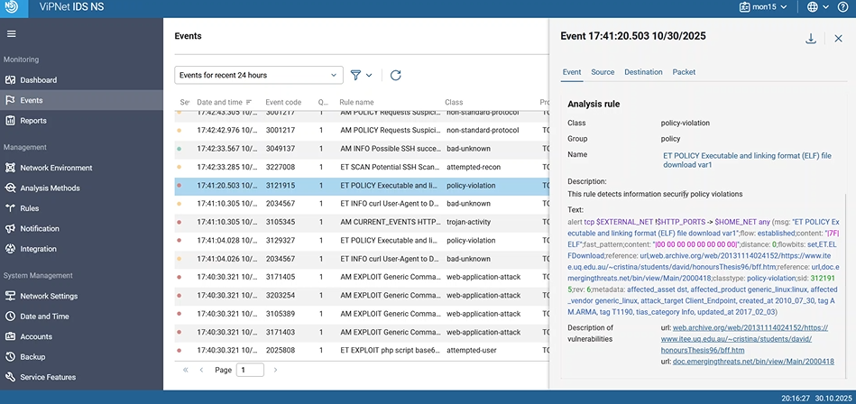{ #fig:300 width=70% }

#

## Добавили карточку инцидента "Bitrix vote RCE" (рис. [-@fig:100])

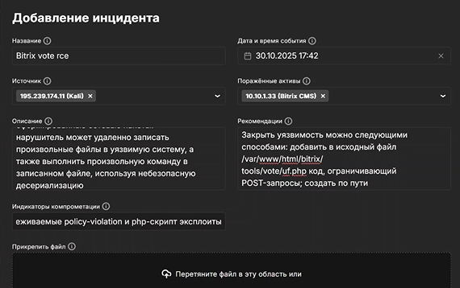{ #fig:100 width=70% }

#

## Добавили карточку инцидента "GitLab RCE" (рис. [-@fig:200])

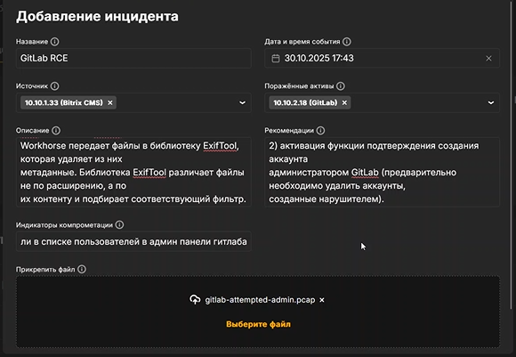{ #fig:200 width=70% }

#

## Добавили карточку инцидента "WSO2 API-Manager RCE" (рис. [-@fig:300])

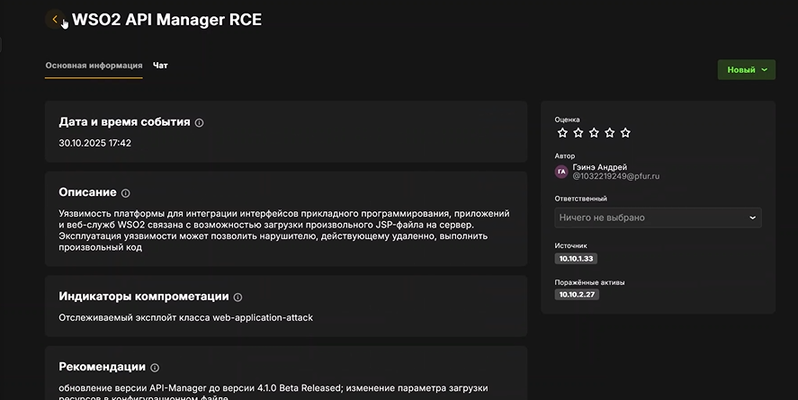{ #fig:300 width=70% }

#

## Bitrix vote RCE. Устранили уязвимость путём отклонения всех запросов к директории vote (рис. [-@fig:003])

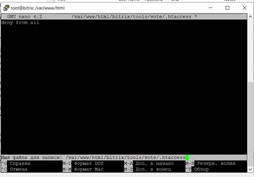{ #fig:003 width=70% }

#

## Bitrix vote RCE. Восстанавливаем бэкап сайта (рис. [-@fig:004])

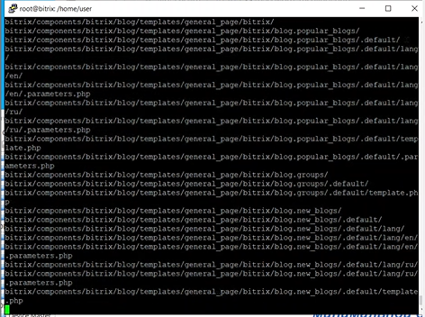{ #fig:004 width=70% }

#

## GitLab RCE. Заходим на панель администратора, ужесточаем регистрацию (рис. [-@fig:005])

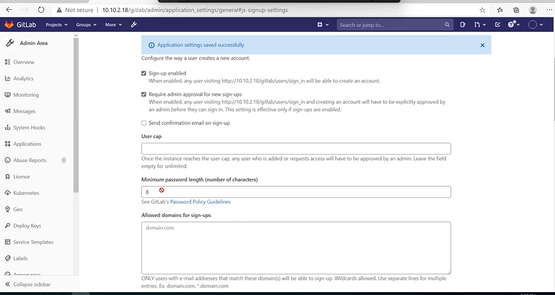{ #fig:005 width=70% }

#

## GitLab RCE. Удаляем неизвестного нам пользователя (рис. [-@fig:006])

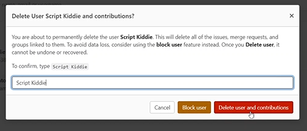{ #fig:006 width=70% }

#

## GitLab RCE. Находим PID сессию с нарушителем, убиваем её (рис. [-@fig:007])

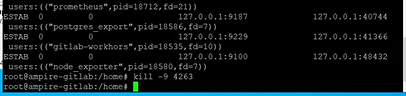{ #fig:007 width=70% }

#

## WSO2 API-Manager RCE. Заходим на MS API Manager, изменяем паарметр загрузки ресурсов (рис. [-@fig:008])

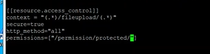{ #fig:008 width=70% }

#

## WSO2 API-Manager RCE. Удаляем бэкдор (рис. [-@fig:009])

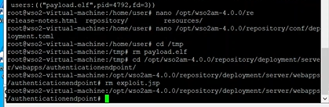{ #fig:009 width=70% }

#

## WSO2 API-Manager RCE. Удаляем нового пользователя (рис. [-@fig:009])

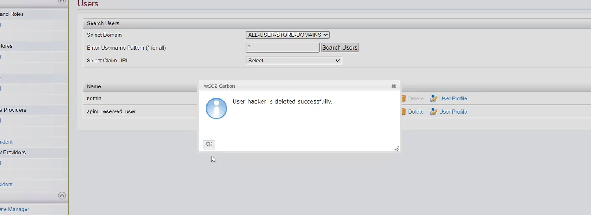{ #fig:010 width=70% }

#

## Все атаки и их последствия успешно устранены

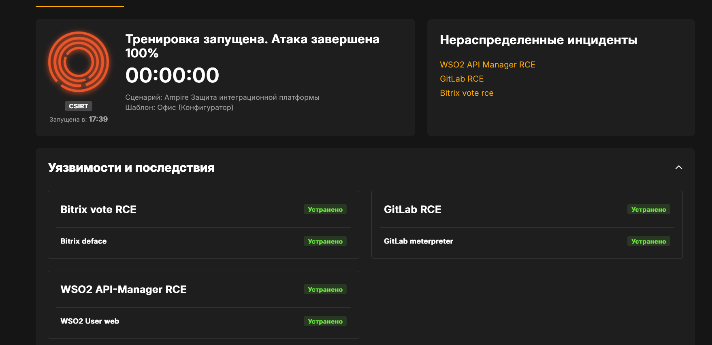{ #fig:011 width=70% }

#

## Выводы

Отработали сценарий: Защита интеграционной платформы. 