---
## Front matter
title: "Отчёт по лабораторной работе 3-D (НФИ-2)"
subtitle: "Программный комплекс обучения методам обнаружения, анализа и устранения последствий компьютерных атак «Ampire»"
author: "Козлов В.П., Гэинэ А., Шуваев С., Джахангиров И.З, Хватов М.Г. | НФИбд-02-22"

## Generic otions
lang: ru-RU
toc-title: "Содержание"

## Bibliography
bibliography: bib/cite.bib
csl: pandoc/csl/gost-r-7-0-5-2008-numeric.csl

## Pdf output format
toc: true # Table of contents
toc-depth: 2
lof: true # List of figures
lot: true # List of tables
fontsize: 12pt
linestretch: 1.5
papersize: a4
documentclass: scrreprt
## I18n polyglossia
polyglossia-lang:
  name: russian
polyglossia-otherlangs:
  name: english
## I18n babel
babel-lang: russian
babel-otherlangs: english
## Fonts
mainfont: Arial
romanfont: Arial
sansfont: Arial
monofont: Arial
mainfontoptions: Ligatures=TeX
romanfontoptions: Ligatures=TeX
sansfontoptions: Ligatures=TeX,Scale=MatchLowercase
monofontoptions: Scale=MatchLowercase,Scale=0.9
## Biblatex
biblatex: true
biblio-style: "gost-numeric"
biblatexoptions:
  - parentracker=true
  - backend=biber
  - hyperref=auto
  - language=auto
  - autolang=other*
  - citestyle=gost-numeric
## Pandoc-crossref LaTeX customization
figureTitle: "Рис."
tableTitle: "Таблица"
listingTitle: "Листинг"
lofTitle: "Список иллюстраций"
lotTitle: "Список таблиц"
lolTitle: "Листинги"
## Misc options
indent: true
header-includes:
  - \usepackage{indentfirst}
  - \usepackage{float} # keep figures where there are in the text
  - \floatplacement{figure}{H} # keep figures where there are in the text
---

# Цель работы

Отработать сценарий: Защита интеграционной платформы

# Задание

1. Обнаружить Bitrix vote RCE на Bitrix Server.

2. Устранить уязвимость путём отклонения всех запросов к директории vote.

3. Устранить последствие (Deface). Восстанавливаем бэкап сайта.

4. Обнаружить GitLab RCE на узле GitLab.

5. Зайти в панель администратора, ужесточить регистрацию. Удалить неизвестных пользователей.

6. Устранить последствие (Gitlab meterpreter). Убиваем сессию нарушителя.

7. Обнаружить WSO2 API-Manager RCE на узле MS API Manager.

8. Изменить параметр загрузки ресурсов в конфиг файле.

9. Устранить последствие (WSO Web User). Удалить нового привилегированного пользователя. Удалить бэкдор

# Выполнение лабораторной работы

На сайте ViPNet IDS NS просмотрели атакованные активы и суть атак (рис. [-@fig:002])

{ #fig:002 width=70% }

Добавили карточку инцидента "Bitrix vote RCE" (рис. [-@fig:100])

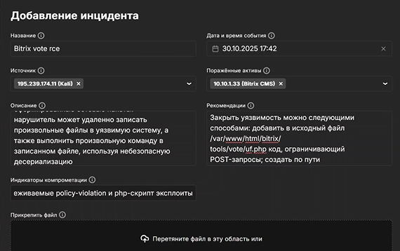{ #fig:100 width=70% }

Добавили карточку инцидента "GitLab RCE" (рис. [-@fig:200])

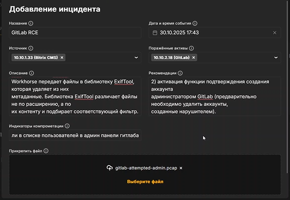{ #fig:200 width=70% }

Добавили карточку инцидента "WSO2 API-Manager RCE" (рис. [-@fig:300])

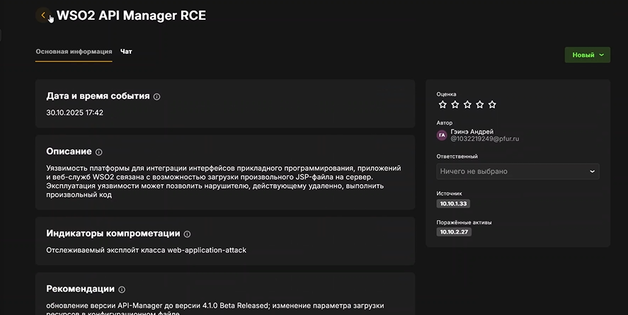{ #fig:300 width=70% }

Bitrix vote RCE. Устранили уязвимость путём отклонения всех запросов к директории vote (рис. [-@fig:003])

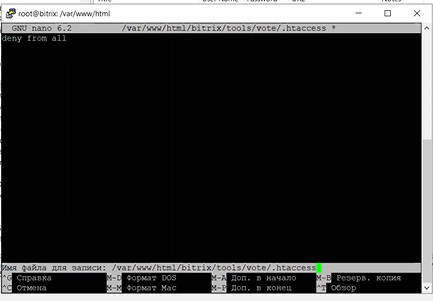{ #fig:003 width=70% }

Bitrix vote RCE. Восстанавливаем бэкап сайта (рис. [-@fig:004])

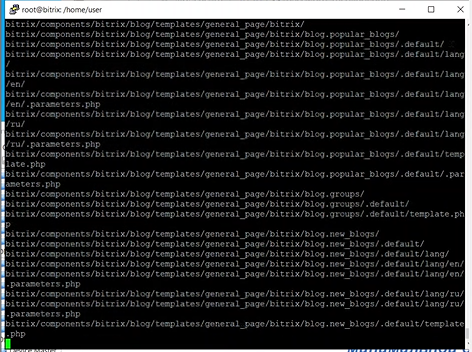{ #fig:004 width=70% }

GitLab RCE. Заходим на панель администратора, ужесточаем регистрацию (рис. [-@fig:005])

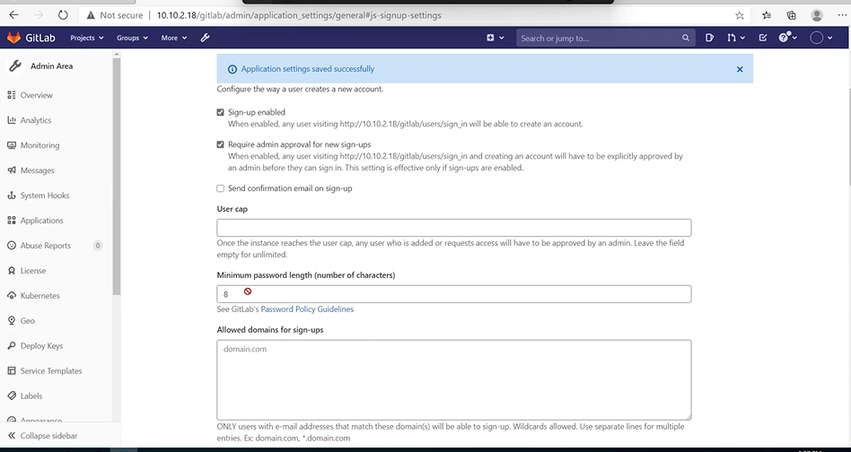{ #fig:005 width=70% }

GitLab RCE. Удаляем неизвестного нам пользователя (рис. [-@fig:006])

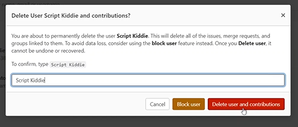{ #fig:006 width=70% }

GitLab RCE. Находим PID сессию с нарушителем, убиваем её (рис. [-@fig:007])

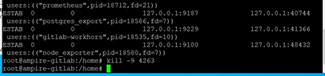{ #fig:007 width=70% }

WSO2 API-Manager RCE. Заходим на MS API Manager, изменяем паарметр загрузки ресурсов (рис. [-@fig:008])

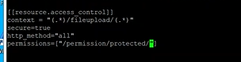{ #fig:008 width=70% }

WSO2 API-Manager RCE. Удаляем бэкдор (рис. [-@fig:009])

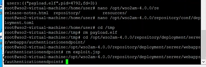{ #fig:009 width=70% }

WSO2 API-Manager RCE. Удаляем нового пользователя (рис. [-@fig:009])

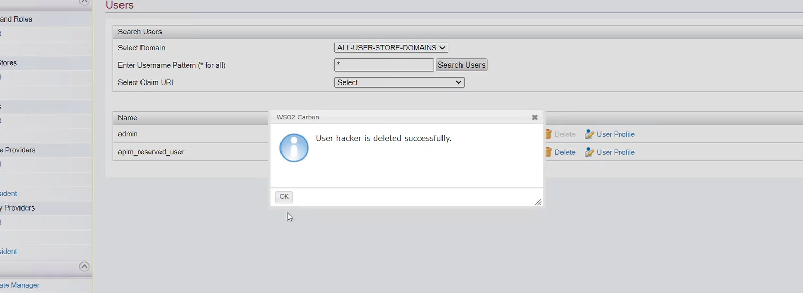{ #fig:010 width=70% }

Все атаки и их последствия успешно устранены

{ #fig:011 width=70% }

# Выводы

Отработали сценарий: Защита интеграционной платформы. 

# Список литературы
1.  **CVE-2019-0630** — Common Vulnerabilities and Exposures.  
    URL: `https://cve.mitre.org/cgi-bin/cvename.cgi?name=CVE-2019-0630`

2.  **CVE-2019-17427** — Уязвимость XSS в Redmine.  
    URL: `https://cve.mitre.org/cgi-bin/cvename.cgi?name=CVE-2019-17427`

3.  **CVE-2019-18890** — Уязвимость Blind SQL-инъекции в Redmine.  
    URL: `https://cve.mitre.org/cgi-bin/cvename.cgi?name=CVE-2019-18890`